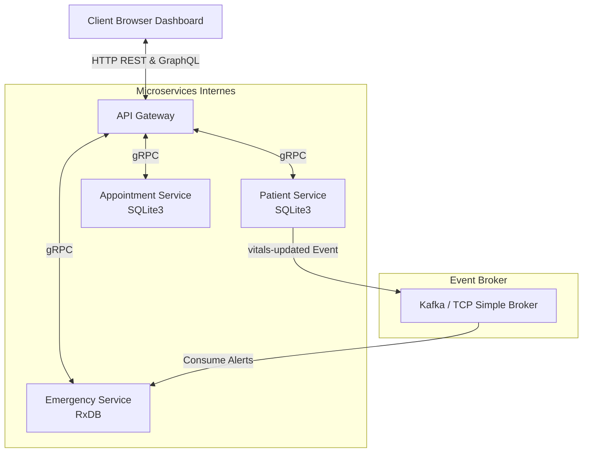

# SmartClinic: Microservices and SOA Clinical Management Platform

SmartClinic is a comprehensive clinical management system built using a Service-Oriented Architecture (SOA) and autonomous microservices. The project is implemented in Node.js, utilizing gRPC for high-performance synchronous communication, GraphQL and REST for client-facing interfaces, and an event-driven pub/sub architecture for real-time critical vital sign alerting.

---

## Architecture Overview

The platform consists of four autonomous services, each managing its own database to enforce database-per-service isolation (polyglot persistence).



### Component Details

#### 1. API Gateway (Port 3000)
Serves as the single entry point for all client requests, abstracting the internal microservices structure from the frontend.
* **Static Server**: Hosts and serves the HTML5/CSS3 administration dashboard.
* **REST Endpoints**: Exposes routes for resource creation, such as patient registration (`POST /api/patients`) and appointment scheduling (`POST /api/appointments`).
* **GraphQL Endpoint (Apollo Server)**:
  * Query `getDoctorDashboard`: Consolidates data from both the Appointment Service and Patient Service to present an integrated view of a doctor's schedule.
  * Query `getActiveAlerts`: Fetches real-time clinical alerts from the Emergency Service.
  * Mutation `updateVitals`: Updates patient vital signs.
* **Internal Routing**: Acts as a gRPC client, routing synchronous requests to the backend microservices.

#### 2. Patient Service (Port 50051)
Manages patient registration, administrative records, and historical clinical data.
* **Database**: Relationally structured SQLite3 database (`patient.db`).
* **Protocol**: gRPC server for low-latency operations.
* **Event Production**: Publishes a `vitals-updated` event to the broker whenever a patient's vitals (temperature, pulse) are updated.

#### 3. Appointment Service (Port 50052)
Handles the scheduling, cancellation, and retrieval of appointments for doctors.
* **Database**: Relationally structured SQLite3 database (`appointment.db`).
* **Protocol**: gRPC server exposing methods to schedule, cancel, and query appointments.

#### 4. Emergency Service (Port 50053)
Monitors patient safety by processing vital updates and generating warnings in real time.
* **Database**: RxDB, a reactive NoSQL document store optimized for real-time query subscriptions.
* **Event Consumption**: Listens for `vitals-updated` events from the broker.
* **Clinical Thresholds**: Evaluates vitals against clinical parameters. When abnormalities are detected (such as temperature exceeding 38.5 degrees Celsius or heart rate exceeding 100 bpm), it automatically registers a critical warning or alert with appropriate severity levels.
* **Protocol**: gRPC server exposing active emergency alerts to the Gateway.

---

## Communication Protocols

* **Synchronous (gRPC)**: Employed for high-performance internal communication where immediate responses are needed (e.g., when the API Gateway queries the Appointment Service).
* **Asynchronous (Publish/Subscribe)**: Used to decouple the Patient Service from the Emergency Service. If the Emergency Service is offline, the Patient Service continues to function, and the broker queues vital updates to prevent data loss.
* **Client-Facing (REST / GraphQL)**: REST is used for straightforward write operations, while GraphQL aggregates complex data queries to minimize network latency and roundtrips.

---

## Deployment Modes and Message Brokers

The message broker architecture supports two modes depending on the execution environment:

1. **Production Mode (Apache Kafka)**: Runs in a Docker environment using a full Apache Kafka broker. This is the enterprise-standard setup.
2. **Development Fallback Mode (TCP Broker)**: A lightweight, custom TCP-based message broker (`shared/simple-broker.js`) written in Node.js. It facilitates development and testing without requiring Docker or Kafka setup.

---

## Setup and Installation

### Prerequisites
* Node.js (version 16 or higher recommended)
* Docker and Docker Compose (optional, required for production mode only)

### Installation
Install all dependencies for the workspace and subprojects using the root configuration:
```bash
npm install
```

### Running Locally (Development Mode)
Start the local TCP broker and all microservices concurrently:
```bash
node run-all.js
```
Once started, the services will be available at:
* **API Gateway and Dashboard**: `http://localhost:3000`
* **GraphQL Playground**: `http://localhost:3000/graphql`
* **Patient Service (gRPC)**: `localhost:50051`
* **Appointment Service (gRPC)**: `localhost:50052`
* **Emergency Service (gRPC)**: `localhost:50053`

### Running with Docker (Production Mode)
Build and spin up the containers including Apache Kafka, Zookeeper, and the services:
```bash
docker-compose up --build
```

---

## Automated Verification

You can validate the end-to-end integration and the event-driven workflow using the provided test scenario script:
```bash
npm run test-flow
```

The test script automates the following steps:
1. Registers a patient via the Gateway REST API.
2. Schedules an appointment via the Gateway REST API.
3. Retrieves the doctor's consolidated dashboard using GraphQL.
4. Updates patient vitals to critical values (e.g., high temperature and heart rate) via a GraphQL mutation.
5. Verifies that the Emergency Service consumes the published event, runs threshold logic, and creates an alert record in the RxDB document store.
