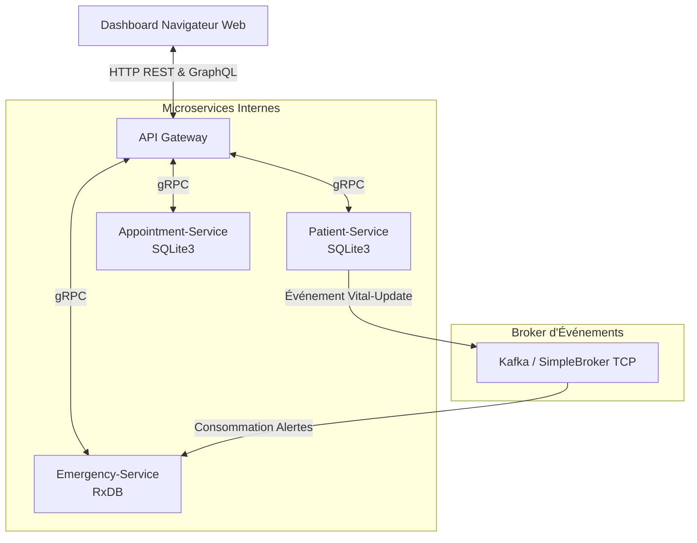

# 🏥 SmartClinic - Architecture Microservices & SOA (Explications Détaillées)

Ce document fournit une explication complète et approfondie du projet **SmartClinic**, un système intelligent de gestion de clinique médicale basé sur une **Architecture Orientée Services (SOA)** et des **Microservices autonomes**.

---

## 📌 1. Vue d'ensemble du Projet
Le projet **SmartClinic** est une application conçue pour gérer en temps réel les flux opérationnels d'une clinique médicale. Il permet de :
1. **Gérer les patients** et leurs dossiers médicaux (constantes vitales, antécédents).
2. **Planifier et gérer les rendez-vous** des médecins.
3. **Surveiller en temps réel les alertes d'urgence** médicales grâce à l'analyse automatique des constantes vitales anormales.

---

## 🏗️ 2. Architecture Technique Générale

L'application repose sur un découpage en **4 briques logicielles autonomes (microservices)** communicant via différents protocoles selon les besoins (synchrone vs asynchrone).



---

## ⚙️ 3. Description des Composants

### A. 🎛️ API Gateway (Port `3000`)
C'est le **point d'entrée unique** de l'application pour le client web. Il masque la complexité interne en redirigeant les requêtes vers les bons microservices.
* **Serveur Web statique** : Fournit le Dashboard HTML5/CSS3.
* **API REST** : Expose les routes d'inscription de patients (`POST /api/patients`) et de planification de rendez-vous (`POST /api/appointments`).
* **API GraphQL (Apollo Server)** :
  * Query `getDoctorDashboard` : Récupère le planning d'un médecin en fusionnant les données des services *Appointment* et *Patient* (jointure de données distribuées).
  * Query `getActiveAlerts` : Récupère les alertes médicales urgentes stockées dans le service *Emergency*.
  * Mutation `updateVitals` : Met à jour les constantes médicales (température, pouls).
* **Communication Interne** : Utilise des clients **gRPC** pour appeler les microservices sous-jacents de manière ultra-rapide.

### B. 👤 Patient-Service (Port `50051`)
Gère les informations administratives et médicales des patients.
* **Persistance** : Base de données relationnelle locale **SQLite3** (`patient.db`).
* **Protocole** : Serveur **gRPC** exposant les méthodes de création de patient et de mise à jour des constantes vitales.
* **Rôle Événementiel** : Lorsqu'une constante vitale (rythme cardiaque, température) est mise à jour, ce service publie un événement `vitals-updated` dans le Broker (Kafka ou SimpleBroker).

### C. 📅 Appointment-Service (Port `50052`)
Gère l'agenda des médecins et les réservations.
* **Persistance** : Base de données relationnelle locale **SQLite3** (`appointment.db`).
* **Protocole** : Serveur **gRPC** permettant la réservation et la recherche de rendez-vous pour un médecin et un jour spécifiques.

### D. 🚨 Emergency-Service (Port `50053`)
Assure la surveillance critique des patients en temps réel.
* **Persistance** : Base de données NoSQL orientée documents **RxDB** (technologie réactive idéale pour le temps réel).
* **Protocole** :
  * Serveur **gRPC** pour exposer les alertes en cours.
  * **Consommateur d'événements** : Écoute en continu le Broker de messages. Dès qu'un message de mise à jour de constantes vitale arrive, il analyse les valeurs :
    * Si la température dépasse **38.5°C** (Fièvre) ou si le pouls dépasse **100 bpm** (Tachycardie), il génère immédiatement une **alerte d'urgence** avec un niveau de sévérité (`CRITICAL` ou `WARNING`) et l'enregistre en base de données.

---

## 📨 4. Le Broker de Messages (Asynchronisme)
Dans une architecture microservices, pour éviter le couplage fort et garantir que la mise à jour des constantes ne bloque pas l'application en cas de panne du service d'urgence, la communication se fait de manière **asynchrone**.

Deux modes de Broker sont implémentés dans SmartClinic :
1. **Apache Kafka (Production)** : Déployé via Docker-compose, c'est le standard industriel pour le streaming d'événements à grande échelle.
2. **SimpleBroker TCP (Développement Local)** : Un mini-broker TCP léger développé sur mesure en Node.js (dans `shared/simple-broker.js`). Il permet de simuler la publication et l'abonnement (Pub/Sub) sans avoir besoin d'installer ou de démarrer Docker.

---

## 🧪 5. Scénario de Test / Flux de Données Typique

Le fichier `test-scenarios.js` valide le bon fonctionnement de l'ensemble de la chaîne de communication :

1. **Création du Patient** : `API Gateway` (REST) ➡️ appel gRPC ➡️ `Patient-Service` (Écrit dans `patient.db`).
2. **Création du Rendez-vous** : `API Gateway` (REST) ➡️ appel gRPC ➡️ `Appointment-Service` (Écrit dans `appointment.db`).
3. **Affichage du Tableau de Bord Médecin** :
   * Le client demande en **GraphQL** le planning du médecin `d1`.
   * L'API Gateway appelle gRPC `Appointment-Service` pour avoir la liste des rendez-vous.
   * L'API Gateway appelle gRPC `Patient-Service` pour récupérer les détails de chaque patient associé au rendez-vous.
   * Les données sont fusionnées et renvoyées au client.
4. **Mise à jour et Détection d'Urgence** :
   * Le client envoie une mutation GraphQL pour mettre à jour les constantes de `Sarah Connor` à **39.5°C** de température et **135 bpm** de rythme cardiaque.
   * L'API Gateway transmet l'ordre en gRPC au `Patient-Service`.
   * Le `Patient-Service` sauvegarde les constantes et **publie un événement** sur le Broker.
   * L'événement est intercepté de manière asynchrone par `Emergency-Service`.
   * `Emergency-Service` détecte les anomalies, crée une alerte, et l'enregistre dans **RxDB**.
   * Le Dashboard web (ou le script de test) interroge le GraphQL de l'API Gateway, qui interroge gRPC `Emergency-Service`, et l'alerte apparaît en temps réel à l'écran.

---

## 🚀 6. Commandes Utiles

* **Installation des dépendances** (gère tous les workspaces automatiquement) :
  ```bash
  npm install
  ```
* **Lancement local rapide** (utilise le broker TCP simulé) :
  ```bash
  node run-all.js
  ```
* **Lancement en mode nominal** (avec Docker et Kafka) :
  ```bash
  docker-compose up --build
  ```
* **Exécution du script de test d'intégration automatique** :
  ```bash
  npm run test-flow
  ```
